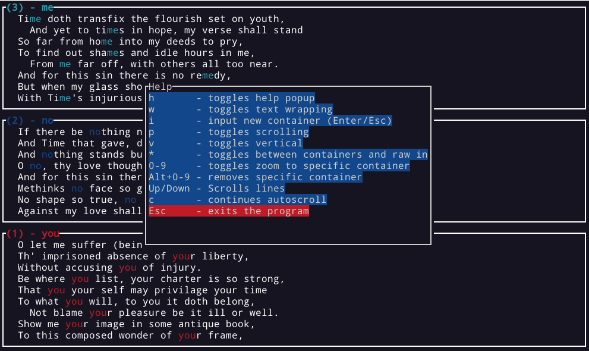
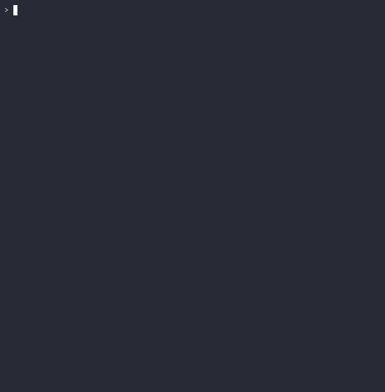

<h1 align="center">
  <br>
  
  <br>
  <br>
</h1>

<h5 align="center">logs splitter</h5>
<h4 align="center">A simple command line tool that helps you visualize an input stream of text.</h4>



<p align="center">
  
  
  <a href="https://codecov.io/gh/todoesverso/logss" >
    
  </a>
</p>

<p align="center">
  <a href="#key-features">Key Features</a> •
  <a href="#usage">Usage</a> •
  <a href="#screenshots">Screenshots</a> •
  <a href="#download">Download</a> •
  <a href="#roadmap">Roadmap</a> •
  <a href="#license">License</a>
</p>

## Key Features

* Select render/stream speed
* Automatic color assigned to each string match
* Vertical and Horizontal view
* Pause and continue stream
* Scroll Up/Down
* Delete containers on runtime
* Add new containers on runtime
* Dedicated container for raw stream
* Toggle line wrapping
* Zoom into a specific container
* Containers Show/Hide 
* Support for regexp
* Support for configuration file
* Support for explicit command (no need to pipe into it)


## Usage

  ```sh
  $ logss -h
  Simple cli command to show logs in a friendly way

  Usage: logss [OPTIONS]

  Options:
    -c <CONTAINERS>  Finds the substring (regexp)
    -C <COMMAND>     Gets input from this command
    -r <RENDER>      Defines render speed in milliseconds [default: 100]
    -f <FILE>        Input config file (overrides cli arguments)
    -V               Start in vertical view mode
    -h               Print help

  $ cat shakespeare.txt | logss -c to -c be -c or -c 'in.*of'
  $ # 
  $ cat real_curl_example.yaml
    command:
      - curl
      - -s
      - https://raw.githubusercontent.com/linuxacademy/content-elastic-log-samples/master/access.log
    render: 75
    containers:
      - GET
      - "404"
      - ".*ERROR|error.*"
  $ logss -f real_curl_example.yaml 
  ```

## Screenshots
<details>
  <summary>File Configuration</summary>

  [](https://asciinema.org/a/581505)

</details>
<details>
  <summary>Zooms</summary>

  

</details>
<details>
  <summary>Pause</summary>

  

</details>
<details>
  <summary>Vertical toggle</summary>

  

</details>
<details>
  <summary>Dynamic input and removal</summary>

  

</details>

<details>
  <summary>Configuration file</summary>

  ```sh
  $ cat shakespeare.txt | logss -f example_config.yml
  ```

</details>

<details>
  <summary>Command</summary>

  ```sh
  $ logss -C cat shakespeare.txt
  ```

</details>


## Download

Pre compiled binaries for several platforms can be downloaded from the [release](https://github.com/todoesverso/logss/releases) section.

## Roadmap

This is just a personal project intended to learn Rust, so things move slowly. 
Currently it is an Alpha release because there are several things missing but it works and can be useful for someone.

This is a list of things I plan to do:

* Add documentation (the rust way)
* Refactoring (as I learn more Rust things)
* Tests
* Smart timestamp highlights
* ... whatever I can think of when I am using it

## License

MIT
