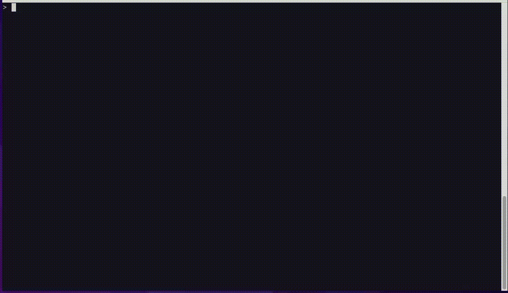

# WIP!!! logss - Logs Splitter

A simple CLI tool that helps you parse you live logs.

## Roadmap

- [ ] Refactor!
- [ ] Dynamic search
- [ ] Pause
- [ ] Clever matching and highlights
- [ ] Scroll up/down
